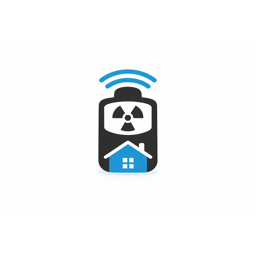

# RadPro Home Assistant Integration

<p align="center">
  
</p>

<p align="center">
  <a href="https://github.com/hacs/integration"></a>
  <a href="https://github.com/Defensor7/radpro-ha/releases"></a>
  <a href="https://opensource.org/licenses/MIT"></a>
  <a href="https://www.home-assistant.io/"></a>
</p>

Home Assistant integration for [Rad Pro](https://github.com/Gissio/radpro) radiation detector devices (Geiger-Müller tube based dosimeters).

## Table of Contents

- [Features](#features)
- [Installation](#installation)
  - [HACS (Recommended)](#hacs-recommended)
  - [Manual Installation](#manual-installation)
- [Configuration](#configuration)
- [Sensors](#sensors)
- [How It Works](#how-it-works)
- [Development](#development)
- [Troubleshooting](#troubleshooting)
- [License](#license)

## Features

- **Auto-detection** of RadPro devices on serial ports (`/dev/ttyACM*`, `/dev/ttyUSB*`)
- **Radiation measurements:**
  - CPS (counts per second)
  - CPM (counts per minute)
  - µSv/h (dose rate in microsieverts per hour)
  - Tube pulse count (lifetime counter)
- **Device diagnostics:**
  - Device ID
  - Battery voltage (per cell)
- **Periodic refresh** of tube sensitivity and device info

## Installation

### HACS (Recommended)

1. Open HACS in your Home Assistant
2. Click on "Integrations"
3. Click the three dots menu → "Custom repositories"
4. Add repository URL: `https://github.com/Defensor7/radpro-ha`
5. Select category: "Integration"
6. Click "Add"
7. Search for "RadPro" and install
8. Restart Home Assistant
9. Add configuration to `configuration.yaml`

### Manual Installation

1. Download the latest release from [GitHub Releases](https://github.com/Defensor7/radpro-ha/releases)
2. Copy the `custom_components/radpro` folder to your Home Assistant's `config/custom_components/` directory
3. Restart Home Assistant
4. Add configuration to `configuration.yaml`

## Configuration

### UI Configuration (Recommended)

1. Go to **Settings** → **Devices & Services**
2. Click **+ Add Integration**
3. Search for **RadPro**
4. Select serial port (or use `auto` for auto-detection)
5. Configure scan interval
6. Click **Submit**

### YAML Configuration (Deprecated)

You can still use YAML configuration, but UI is recommended:

```yaml
radpro:
  port: auto                    # or /dev/ttyACM0, /dev/ttyUSB0, etc.
  baudrate: 115200              # serial port baudrate (default: 115200)
  scan_interval: 2              # polling interval in seconds (default: 2)
```

### Configuration Options

| Option | Type | Default | Description |
|--------|------|---------|-------------|
| `port` | string | `auto` | Serial port path or `auto` for auto-detection |
| `baudrate` | int | `115200` | Serial port baudrate |
| `scan_interval` | int | `2` | Polling interval in seconds |

## Sensors

After configuration, the following sensors will be available:

| Sensor | Description | Unit |
|--------|-------------|------|
| `sensor.radiation_cps` | Counts per second | cps |
| `sensor.radiation_cpm` | Counts per minute | cpm |
| `sensor.radiation_usv_h` | Dose rate | µSv/h |
| `sensor.tube_pulse_count` | Lifetime pulse counter | pulses |
| `sensor.radpro_device_info` | Device ID + attributes | — |

## How It Works

This integration communicates with RadPro devices via serial port using the same protocol as [radpro-tool.py](https://github.com/Gissio/radpro/blob/main/tools/radpro-tool.py).

### Protocol

- **Baudrate:** 115200
- **Format:** ASCII commands with newline terminator
- **Response:** `OK <value>` on success

### Radiation Calculation

```
CPM = delta_pulses × 60 / delta_time
µSv/h = CPM / tubeSensitivity
```

The `tubeSensitivity` value is device-specific and depends on the GM tube model (e.g., SBM-20: ~153.8 CPM per µSv/h).

---

## Development

### Quick Start

Use the provided development script:

```bash
# Start Home Assistant with the component mounted
./dev-setup.sh start

# After making code changes, restart to apply
./dev-setup.sh restart

# View logs
./dev-setup.sh logs

# Stop and cleanup
./dev-setup.sh clean
```

### Script Options

```bash
./dev-setup.sh [command] [options]

Commands:
  start       Start/create the HA container (default)
  stop        Stop the container
  restart     Restart after code changes
  logs        Show container logs
  shell       Open shell in the container
  clean       Stop and remove container + config
  status      Show container status

Options:
  --port PORT     Serial port (default: auto)
  --config DIR    Config directory (default: ~/ha-radpro-dev/config)
  --tz TIMEZONE   Timezone (default: UTC)
```

### Manual Docker Setup

```bash
docker run -d \
  --name homeassistant-dev \
  --privileged \
  -v ~/ha-dev/config:/config \
  -v /path/to/radpro-ha/custom_components/radpro:/config/custom_components/radpro:ro \
  -v /dev:/dev \
  --network=host \
  ghcr.io/home-assistant/home-assistant:stable
```

### Testing Without Hardware

Create a mock device using `socat`:

```bash
# Terminal 1: Create virtual serial port
socat -d -d pty,raw,echo=0,link=/tmp/radpro-mock pty,raw,echo=0,link=/tmp/radpro-client

# Terminal 2: Run emulator
python3 << 'EOF'
import serial

ser = serial.Serial('/tmp/radpro-client', 115200, timeout=1)
pulse_count = 1000000

while True:
    line = ser.readline().decode().strip()
    if not line:
        continue
    
    print(f"< {line}")
    
    if line == "GET deviceId":
        response = "OK RadPro-Mock-001"
    elif line == "GET tubePulseCount":
        pulse_count += 5  # ~5 cps
        response = f"OK {pulse_count}"
    elif line == "GET tubeSensitivity":
        response = "OK 153.8"  # SBM-20
    elif line == "GET deviceBatteryVoltage":
        response = "OK 1.45"
    else:
        response = "ERROR unknown command"
    
    print(f"> {response}")
    ser.write((response + "\n").encode())
EOF
```

Then configure:

```yaml
radpro:
  port: /tmp/radpro-mock
```

### Debug Logging

Add to `configuration.yaml`:

```yaml
logger:
  default: warning
  logs:
    custom_components.radpro: debug
```

## Troubleshooting

### Device Not Found

1. Check if the device is connected:
   ```bash
   ls -la /dev/ttyACM* /dev/ttyUSB*
   ```

2. Check permissions:
   ```bash
   # Add user to dialout group
   sudo usermod -a -G dialout $USER
   ```

3. Test communication directly:
   ```bash
   python3 -c "
   import serial
   ser = serial.Serial('/dev/ttyACM0', 115200, timeout=1)
   ser.write(b'GET deviceId\n')
   print(ser.readline().decode().strip())
   "
   ```

### Docker Serial Port Access

Make sure to run Docker with `--privileged` flag and mount `/dev`:

```bash
docker run --privileged -v /dev:/dev ...
```

### No Sensor Values

- Check Home Assistant logs for errors
- Verify the device is responding to commands
- Ensure `tubeSensitivity` is being read correctly (check debug logs)

## Contributing

Contributions are welcome! Please:

1. Fork the repository
2. Create a feature branch (`git checkout -b feature/amazing-feature`)
3. Commit your changes (`git commit -m 'Add amazing feature'`)
4. Push to the branch (`git push origin feature/amazing-feature`)
5. Open a Pull Request

## Links

- [Rad Pro Project](https://github.com/Gissio/radpro)
- [radpro-tool.py](https://github.com/Gissio/radpro/blob/main/tools/radpro-tool.py)
- [Home Assistant Developer Docs](https://developers.home-assistant.io/)

## License

This project is licensed under the MIT License - see the [LICENSE](LICENSE) file for details.
